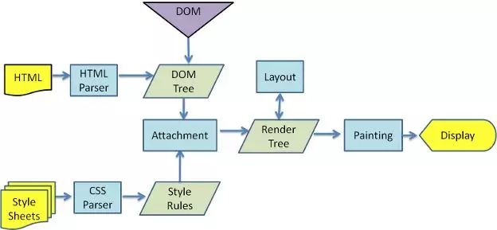

# 渲染机制

## 浏览器渲染机制

浏览器的渲染机制一般分为以下几个步骤

1. 将 HTML 构建成一个 DOM 树（DOM = Document Object Model 文档对象模型），DOM 树的构建过程是一个深度遍历过程：当前节点的所有子节点都构建好后才会去构建当前节点的下一个兄弟节点。
2. 解析 CSS 样式，生成 CSSOM 树
3. 结合 DOM 树和 CSSOM 生成 Rendering Tree（渲染树）。注意：Rendering Tree 渲染树并不等同于 DOM 树，因为一些像 Header 或 display:none 的东西就没必要放在渲染树中了。
4. 下一步操作称之为布局（Layout），顾名思义就是计算出每个节点在屏幕中的位置 layout render tree。
5. 再下一步就是绘制(Paint)，即遍历 render 树，并使用浏览器 UI 后端层绘制每个节点。
6. Display：将像素发送给GPU，展示在页面上。

## 图层

一般来说，可以把普通文档流看成一个图层。特定的属性可以生成一个新的图层。**不同的图层渲染互不影响**，所以对于某些频繁需要渲染的建议单独生成一个新图层，提高性能。但也**不能生成过多的图层，会引起反作用**。

通过以下几个常用属性可以生成新图层

- 3D 变换：`translate3d`、`translateZ`
- `will-change`
- `video`、`iframe` 标签
- 通过动画实现的 `opacity` 动画转换
- `position: fixed`

## 重绘（Repaint）和回流（Reflow）

重绘和回流是渲染步骤中的一小节，但是这两个步骤对于性能影响很大。

- 重绘是当节点需要更改外观而不会影响布局的，比如改变 `color` 就叫称为重绘
- 回流是布局或者几何属性需要改变就称为回流。

回流必定会发生重绘，重绘不一定会引发回流。回流所需的成本比重绘高的多，改变深层次的节点很可能导致父节点的一系列回流。

所以以下几个动作可能会导致性能问题：

- 改变 window 大小
- 改变字体
- 添加或删除样式
- 文字改变
- 定位或者浮动
- 盒模型

很多人不知道的是，重绘和回流其实和 Event loop 有关。

- 当 Event loop 执行完 Microtasks 后，会判断 document 是否需要更新。因为浏览器是 60Hz 的刷新率，每 16ms 才会更新一次。
- 然后判断是否有 `resize` 或者 `scroll` ，有的话会去触发事件，所以 `resize` 和 `scroll` 事件也是至少 16ms 才会触发一次，并且自带节流功能。
- 判断是否触发了`media query`
- 更新动画并且发送事件
- 判断是否有全屏操作事件
- 执行 `requestAnimationFrame` 回调
- 执行 `IntersectionObserver` 回调，该方法用于判断元素是否可见，可以用于懒加载上，但是兼容性不好
- 更新界面

以上就是一帧中可能会做的事情。如果在一帧中有空闲时间，就会去执行 requestIdleCallback 回调。
