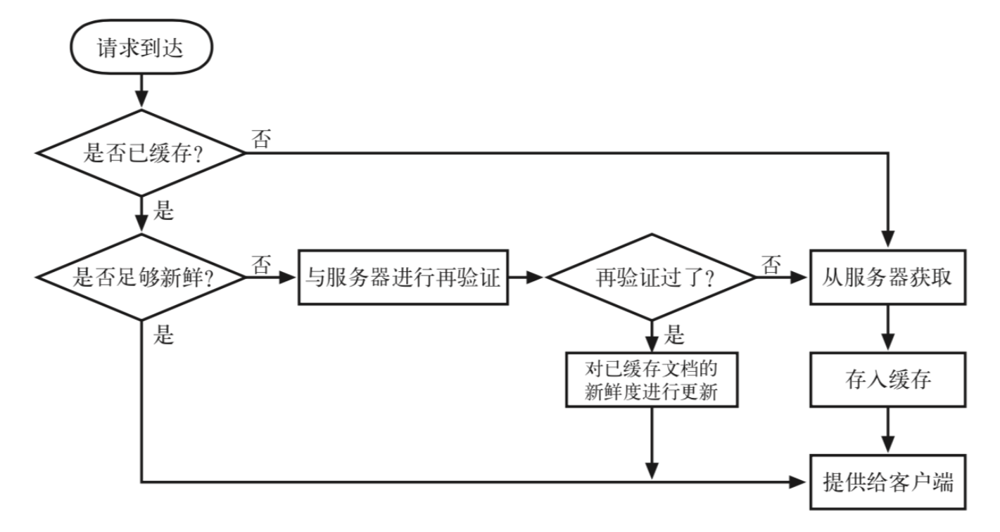

# 1. 浏览器缓存机制

## 1.1. 缓存基本认识

Web 缓存是可以自动保存常见文档副本的 HTTP 设备。当 Web 请求抵达缓存时，如果本地有“已缓存的”副本，就可以从本地存储设备而不是原始服务器中提取这个文档。

### 1.1.1. 缓存的优缺点

- 优点：

  - 缓存减少了冗余的数据传输，节省了你的网络费用。
  - 缓存缓解了网络瓶颈的问题。不需要更多的带宽就能够更快地加载页面。
  - 缓存降低了对原始服务器的要求。服务器可以更快地响应，避免过载的出现。
  - 缓存降低了距离时延，因为从较远的地方加载页面会更慢一些。

- 缺点：

  - 缓存中的数据可能与服务器的数据不一致；
  - 消耗内存；

## 1.2. 缓存的验证

缓存分为：

- 强缓存
- 协商缓存

1. 浏览器在加载资源时，先根据这个资源的一些 `http header` 判断它是否命中强缓存，强缓存如果命中，浏览器直接从自己的缓存中读取资源，不会发请求到服务器。比如某个 css 文件，如果浏览器在加载它所在的网页时，这个 css 文件的缓存配置命中了强缓存，浏览器就直接从缓存中加载这个 css，连请求都不会发送到网页所在服务器；

2. 当强缓存没有命中的时候，浏览器一定会发送一个请求到服务器，通过服务器端依据资源的另外一些 `http header` 验证这个资源是否命中协商缓存，如果协商缓存命中，服务器会将这个请求返回，但是不会返回这个资源的数据，而是告诉客户端可以直接从缓存中加载这个资源，于是浏览器就又会从自己的缓存中去加载这个资源；

3. 强缓存与协商缓存的共同点是：如果命中，都是从客户端缓存中加载资源，而不是从服务器加载资源数据；区别是：强缓存不发请求到服务器，协商缓存会发请求到服务器。

4. 当协商缓存也没有命中的时候，浏览器直接从服务器加载资源数据。

## 1.3. 强缓存

**强缓存**：用请求服务器，直接使用本地的缓存。
强缓存是利用 http 响应头中的**Expires**或**Cache-Control**实现的。

浏览器第一次请求一个资源时，服务器在返回该资源的同时，会把上面这两个属性放在 `response header` 中。

**注意**：

这两个 `response header` 属性可以只启用一个，也可以同时启用。当 `response header` 中，`Expires` 和 `Cache-Control` 同时存在时，**Cache-Control 的优先级高于 Expires**。

### 1.3.1. Expires：服务器返回的**绝对时间**，用 GMT 格式的字符串表示。

**缓存原理**：

1. 浏览器第一次跟服务器请求一个资源，服务器在返回这个资源的同时，在 respone 的 header 加上 `Expires` 的 header
2. 浏览器在接收到这个资源后，会把这个资源连同所有 `response header` 一起缓存下来（所以缓存命中的请求返回的 header 并不是来自服务器，而是来自之前缓存的 header）；
3. 浏览器再请求这个资源时，先从缓存中寻找，找到这个资源后，拿出它的 `Expires` 跟当前的请求时间比较，如果请求时间在 `Expires` 指定的时间之前，就能命中缓存，否则就不行。
4. 如果缓存没有命中，浏览器直接从服务器加载资源时，`Expires Header` 在重新加载的时候会被更新。

是较老的强缓存管理 `response header`。浏览器再次请求这个资源时，先从缓存中寻找，找到这个资源后，拿出它的 `Expires` 跟当前的请求时间比较，如果请求时间在 `Expires` 的时间之前，就能命中缓存，否则就不行。

如果缓存没有命中，浏览器直接从服务器请求资源时，`Expires Header` 在重新请求的时候会被更新。

**缺点**：

由于 Expires 是服务器返回的一个绝对时间，存在的问题是：服务器的事件和客户端的事件可能不一致。在服务器时间与客户端时间相差较大时，缓存管理容易出现问题，比如随意修改客户端时间，就能影响缓存命中的结果。所以，在 http1.1 中，提出了一个新的 `response header`，就是 `Cache-Control`。

### 1.3.2. Cache-Control：服务器返回的**相对时间**，利用 max-age 判断缓存的生命周期，以秒为单位。

http1.1 中新增的 `response header`。浏览器第一次请求资源之后，在接下来的相对时间之内，都可以利用本地缓存。超出这个时间之后，则不能命中缓存。重新请求时，`Cache-Control` 会被更新。

**缓存原理**：

1. 浏览器第一次跟服务器请求一个资源，服务器在返回这个资源的同时，在 `respone` 的 header 加上 `Cache-Control` 的 header
2. 浏览器在接收到这个资源后，会把这个资源连同所有 `response header` 一起缓存下来；
3. 浏览器再请求这个资源时，先从缓存中寻找，找到这个资源后，根据它第一次的请求时间和 `Cache-Control` 设定的有效期，计算出一个资源过期时间，再拿这个过期时间跟当前的请求时间比较，如果请求时间在过期时间之前，就能命中缓存，否则就不行。
4. 如果缓存没有命中，浏览器直接从服务器加载资源时，`Cache-Control` Header 在重新加载的时候会被更新。

## 1.4. 协商缓存

当浏览器对某个资源的请求没有命中强缓存，就会发一个请求到服务器，验证协商缓存是否命中，如果协商缓存命中，请求响应返回的 http 状态为 304 并且会显示一个 Not Modified 的字符串。
查看单个请求的 Response Header，也能看到 304 的状态码和 Not Modified 的字符串，只要看到这个就可说明这个资源是命中了协商缓存，然后从客户端缓存中加载的，而不是服务器最新的资源：

协商缓存是利用的是两对 Header：

第一对：`Last-Modified`、`If-Modified-Since`

第二对：`ETag`、`If-None-Match`

ETag（Entity Tag）：被请求变量的实体值。

### 1.4.1. `Last-Modified`、`If-Modified-Since`

过程如下：

1. 浏览器第一次请求一个资源，服务器在返回这个资源的同时，会加上 `Last-Modified` 这个 `response header`，这个 header 表示这该资源在服务器上的最后修改时间；
2. 浏览器再次请求这个资源时，会加上 `If-Modified-Since` 这个 request header，这个 header 的值就是上一次返回的 `Last-Modified` 的值；
3. 服务器收到第二次请求时，会比对浏览器传过来的 `If-Modified-Since` 和资源在服务器上的最后修改时间 `Last-Modified`，判断资源是否有变化。如果没有变化则返回 304 Not Modified，但不返回资源内容（此时，服务器不会返回 Last-Modified 这个 `response header`）；如果有变化，就正常返回资源内容（继续重复整个流程）。这是服务器返回 304 时的 `response header`；
4. 浏览器如果收到 304 的响应，就会从缓存中加载资源。

**缺点**：
`Last-Modified`、`If-Modified-Since` 一般来说都是非常可靠的，但面临的问题是：

- **服务器上的资源变化了，但是最后的修改时间却没有变化。**

- 如果服务器端在一秒内修改文件两次，但产生的 Last-Modified 却只有一个值。

这一对 header 就无法解决这种情况。于是，下面这一对 header 出场了。

### 1.4.2. `ETag`、`If-None-Match`

过程如下：

1. 浏览器第一次请求一个资源，服务器在返回这个资源的同时，会加上 `ETag` 这个 `response header`，这个 header 是服务器根据当前请求的资源生成的**唯一标识**。这个唯一标识是一个字符串，只要资源有变化这个串就不同，跟最后修改时间无关，所以也就很好地补充了 Last-Modified 的不足；
2. 浏览器再次请求这个资源时，会加上 `If-None-Match` 这个 request header，这个 header 的值就是上一次返回的 `ETag` 的值；
3. 服务器第二次请求时，会对比浏览器传过来的 `If-None-Match` 和服务器重新生成的一个新的 `ETag`，判断资源是否有变化。如果没有变化则返回 304 Not Modified，但不返回资源内容（此时，由于 `ETag` 重新生成过，`response header` 中还会把这个 `ETag` 返回，即使这个 `ETag` 并无变化）。如果有变化，就正常返回资源内容（继续重复整个流程）。这是服务器返回 304 时的 `response header`：
4. 浏览器如果收到 304 的响应，就会从缓存中加载资源。

## 1.5. 浏览器行为对缓存的影响

如果资源已经被浏览器缓存下来，在缓存失效之前，再次请求时，默认会先检查是否命中强缓存，如果强缓存命中则直接读取缓存，如果强缓存没有命中则发请求到服务器检查是否命中协商缓存，如果协商缓存命中，则告诉浏览器还是可以从缓存读取，否则才从服务器返回最新的资源。这是默认的处理方式，这个方式可能被浏览器的行为改变：

1. 当 ctrl+f5 强制刷新网页时，直接从服务器加载，跳过强缓存和协商缓存；

2. 当 f5 刷新网页时，跳过强缓存，但是会检查协商缓存；
